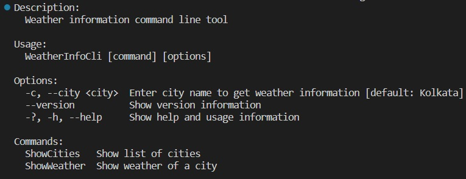
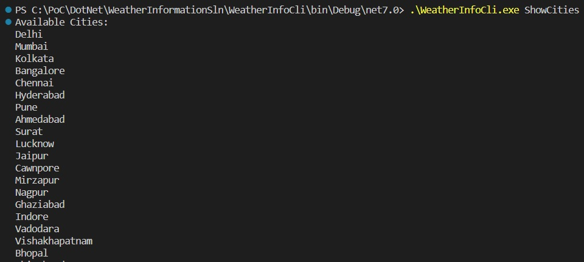
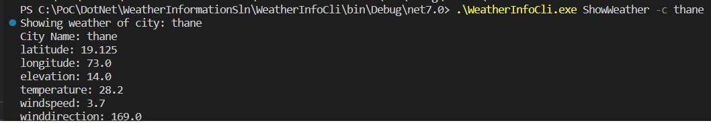

# WeatherInformation-CLI
 Weather Information with command line interface
 
 this exe accept city name and display weather information from below link

 [https://api.open-meteo.com/](https://api.open-meteo.com/)

 internally it will hit the api ([api link](https://api.open-meteo.com/v1/forecast?latitude=18.9667&longitude=72.8333&current_weather=true))
 
 Clone this repo and build the project & generate exe usnig below command
 ```console
 dotnet build
```

 this exe has two cli command "ShowCities" & "ShowWeather" alog with few default commands
 ```console
 .\WeatherInfoCli.exe -h
 ```
 **Output:**
 
 

to run this exe you need to goto WeatherInfoCli.exe folder (bin folder) and opne a command prompt

show list of cities:
```sh
.\WeatherInfoCli.exe ShowCities
```
**Output:**



show weather of any cities which displayed using above command
```console
.\WeatherInfoCli.exe ShowWeather -c pune
```
**Output:**

